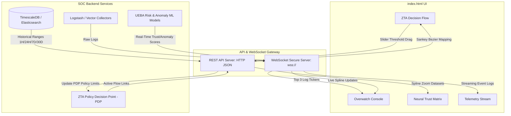

# Integration Guide - Connecting Neural Command Dashboard to Real-World Metrics

This document outlines the architectural blueprint and mapping required to connect the **Neural Command Dashboard** frontend to a real-world security information and event management (SIEM) backend, machine learning models, and Zero Trust Architecture (ZTA) policy engines.

---

## 1. Real-World Metrics Mapping

The dashboard currently visualizes simulated security telemetry. In a production environment, these correspond to the following real-world security metrics:

### A. Global Trust Pulse (Trust Score)
- **Concept:** A normalized score (0–100%) indicating the current security health of the network.
- **Backend Source:** An aggregated risk score calculated by a risk engine (e.g., Azure AD Identity Protection, Duo Trust Monitor, or a custom user/host behavior analytics (UEBA) engine).
- **Formula Inputs:**
  - Active critical alerts count (Security logs).
  - Failed logins anomaly ratio (Auth logs).
  - Anomalous data egress volume (Network logs).
- **Production Event Sync:** A real-time WebSocket broadcast or a 5-second HTTP polling request.

### B. Anomaly Coefficient
- **Concept:** A numerical coefficient representing deviation from normal baseline behavior.
- **Backend Source:** A Machine Learning anomaly detection model (e.g., Isolation Forest, Autoencoder neural networks, or standard Z-Score statistical limits on traffic volume).
- **Calculation:** Distance metric between the current system feature vector (CPU, connection count, login rate, file size) and the calculated historical baseline.

### C. Exponential Moving Average (EMA)
- **Concept:** A smoothed trendline of the Trust Score showing long-term stability, removing short-term alert noise.
- **Backend Source:** Computed in the data layer using databases like TimescaleDB, InfluxDB, or RedisTimeSeries:
  $$\text{EMA}_t = (\text{Score}_t \times \alpha) + (\text{EMA}_{t-1} \times (1 - \alpha))$$
  *(where $\alpha = 0.08$ is the smoothing factor).*

### D. Slow-Burn Threat Score
- **Concept:** Tracks low-frequency, persistent anomalies (e.g., slow port scans, password spraying over weeks, trickle data exfiltration) that evade simple threshold rules.
- **Backend Source:** Correlation rules in SIEMs (e.g., Splunk ES, Elastic Security) that aggregate matching events on a sliding window (e.g., 7 days or 30 days).

---

## 2. Frontend-to-Backend Architecture

To replace the simulation engine with live production feeds, the architecture should transition to a push-pull model:



---

## 3. Component Connection Specifications

Below is the mapping of frontend UI components to backend endpoints and real-world database sources:

| UI Component | Metric / Value | Recommended Connection | Backend Endpoint | Real-World Backend Data Source |
| :--- | :--- | :--- | :--- | :--- |
| **Global Header** | Connection Status | WebSocket Connection | `/ws/heartbeat` | Live socket heartbeat state |
| **Live Ticker & Telemetry Columns** | 5 categorized raw logs | WebSockets (push) | `/ws/telemetry` | Log collectors (Kafka, ElasticSearch, or Vector) |
| **Global Trust Score Plot** | Real-time Spline + Area | WebSockets or HTTP Polling | `/ws/metrics` or `/api/v1/metrics/live` | UEBA (User & Entity Behavior Analytics) trust database |
| **Matrix Spline Charts** | Large Trust, EMA, and Step plots | HTTP REST API | `/api/v1/metrics/history?range=1H` | Time-series database (TimescaleDB, InfluxDB) |
| **ZTA Decision Flow** | Sankey nodes & traffic links | HTTP REST API | `/api/v1/zta/flows` | Zero Trust Network Access (ZTNA) or Service Mesh (Istio/Envoy) access logs |
| **Anomaly Slider Controller** | Red dashed line | HTTP POST | `/api/v1/zta/threshold` | ZTA Policy Administration Point (PAP) database |
| **Trigger Intrusion Button** | Demo simulator | Disabled in Prod / Mapped to Red Team simulations | `/api/v1/redteam/trigger` | Attack simulation tools (e.g. Caldera, Infection Monkey) |
| **Reset Baseline Button** | Recovery trigger | HTTP POST | `/api/v1/baseline/reset` | Anomaly model calibration service |

---

## 4. Production Integration Code Snippets

### A. Replacing the Simulation Loop with WebSocket Tickers
To connect the live telemetry streams to a real backend, modify the `startSimulation()` function in `index.html` to consume from a WebSocket connection:

```javascript
// Connect to production WebSocket
function connectTelemetryStream() {
  const socket = new WebSocket("wss://soc-gateway.internal.net/ws/telemetry");

  socket.onmessage = function(event) {
    const logEvent = JSON.parse(event.data);
    // logEvent format: { category: 'network', msg: '...', payload: { ... } }
    
    // Inject log into column stream and update rates
    injectProductionLog(logEvent.category, logEvent.msg, logEvent.payload);
  };

  socket.onclose = function() {
    console.warn("WebSocket closed. Attempting reconnect...");
    setTimeout(connectTelemetryStream, 3000);
  };
}
```

### B. Hooking Up Threshold Slider Changes (Deprecated)
> [!NOTE]
> The threshold is now preset and hardcoded directly in the backend. The threshold range slider and the Threshold Coefficient Monitor panel have been removed from the frontend. The `updateThresholdValue()` handler remains in a simplified, protected state to maintain backward-compatibility.

```javascript
function updateThresholdValue(val) {
  anomalyThreshold = parseFloat(val);
  
  // UI Updates
  document.getElementById('txt-slider-val').innerText = anomalyThreshold.toFixed(1);
  document.getElementById('zta-threshold-display').innerText = `LIMIT: ${anomalyThreshold.toFixed(1)}`;
  
  // Persist to Backend Policy Decision Point (PDP)
  fetch('/api/v1/zta/threshold', {
    method: 'POST',
    headers: { 'Content-Type': 'application/json' },
    body: JSON.stringify({ threshold: anomalyThreshold })
  })
  .then(res => {
    if (!res.ok) console.error("Failed to update policy threshold on server");
  })
  .catch(err => console.error("Network error saving threshold:", err));
}
```
